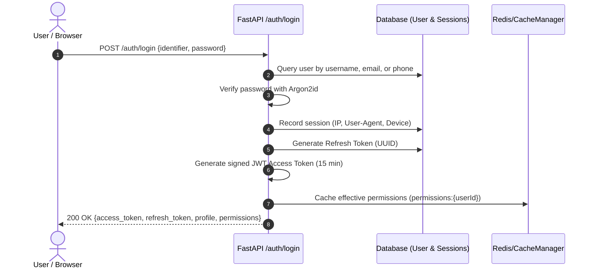

# Enterprise ERP System — Complete Architecture, Feature & Developer Integration Manual

> **System Version:** 1.0.0 (Production)  
> **Last Updated:** August 27, 2026  
> **Architectural Pattern:** Modular Async Monolith (FastAPI) + React 18 SPA (Vite) + Real-Time WebSocket Event Bus  
> **Target Audience:** Systems Architects, Software Engineers, and Autonomous AI Coding Agents.

---

## 1. Executive Architecture Blueprint

```
+---------------------------------------------------------------------------------------------------+
|                                          CLIENT TIER                                              |
|  React 18 Single Page App  |  IHM Design System (Vanilla CSS)  |  WebSocket Real-Time Listener    |
+-------------------------------------------------+-------------------------------------------------+
                                                  | HTTPS / WSS
+-------------------------------------------------v-------------------------------------------------+
|                                     FASTAPI APPLICATION TIER                                      |
|                                                                                                   |
|  [Middleware Pipeline: CORS -> Rate Limiting -> Request Logging -> Security Headers -> Context]   |
|                                                                                                   |
|  +---------------------------+  +---------------------------+  +-------------------------------+  |
|  | Authentication & Sessions |  | RBAC & Department Engine  |  | Inquiries & RFQ Lifecycle     |  |
|  | - Argon2id Password Hash  |  | - Hierarchical Roles      |  | - Multi-Vendor RFQ Tracking   |  |
|  | - JWT Access & Refresh    |  | - Dynamic Permissions     |  | - Quotation Matrix Comparison |  |
|  | - Session Device Registry |  | - User Override Engine    |  | - AI Extraction (GPT-4o/Gemini|  |
|  +---------------------------+  +---------------------------+  +-------------------------------+  |
|  | Master Data & Catalogs    |  | Sourcing & Partners       |  | Master Planning Engine        |  |
|  | - Dynamic Specs Engine    |  | - Suppliers & Contacts    |  | - Dynamic Sheet/Row/Col/Cell  |  |
|  | - Multilevel Categories   |  | - Public Tokenized Portal |  | - Container CBM Optimization  |  |
|  | - Currencies & Geography  |  | - Buyers & Credit Limits  |  | - Cell Status Tagging Engine  |  |
|  +---------------------------+  +---------------------------+  +-------------------------------+  |
|  | Background Workers        |  | Real-Time Event Engine    |  | Governance & Recovery         |  |
|  | - IMAP Email Inbound Poll |  | - WebSocket Manager       |  | - Immutable Audit Logger      |  |
|  | - AI Attachment Extractor |  | - JSON Mutation Broadcast |  | - Universal Soft-Delete / Bin |  |
|  | - Cache Eviction Daemon   |  | - Conflict Prevention     |  | - Field-Level JSON Delta Diff |  |
|  +---------------------------+  +---------------------------+  +-------------------------------+  |
+--------------------------------+----------------------------+-------------------------------------+
                                 |                            |
+--------------------------------v-------+  +-----------------v-------+  +--------------------------+
|            PERSISTENCE TIER            |  |       CACHING TIER      |  |       STORAGE TIER       |
| PostgreSQL / SQLite (SQLAlchemy Async) |  | Redis / InMemoryCache   |  | Local / S3 File Storage  |
| Alembic Versioned Migrations           |  | Namespace-Based Cache   |  | Uploads, PDFs, Datasheet |
+----------------------------------------+  +-------------------------+  +--------------------------+
```

### 1.1. Core System Design Principles
1. **Asynchronous Non-Blocking I/O**: The backend runs exclusively on Python's `asyncio` event loop using `asyncpg` or `aiosqlite`. All database sessions, network requests, AI calls, and file I/O operations are non-blocking.
2. **Optimistic Locking & Concurrency Control**: All core business entities implement a `version` column. Concurrent updates verify the version counter before committing to prevent stale overwrites.
3. **Universal Soft-Delete & Data Integrity**: Entities inherit `SoftDeleteMixin` (`deleted_at`, `deleted_by`). No record is hard-deleted during ordinary workflows; records move to the Trash bin and can be recovered with a single click.
4. **Least-Privilege RBAC with Direct User Overrides**: Access is governed by granular permission codes (`module.action.scope`). Permissions can be assigned to entire Departments or overridden per user (`+ EXTRA GRANTED` / `✕ DIRECT DENIED`).
5. **Deterministic Event Broadcasting**: Entity modifications publish structured WebSocket notifications to all active clients, ensuring user interfaces stay synchronized without polling.

---

## 2. Database Schema & Data Models

The database models are located under `backend/app/` and inherit from declarative base mixins in `backend/app/database/base.py`.

### 2.1. Shared Base Mixins
| Mixin Name | Fields Added | Purpose |
| :--- | :--- | :--- |
| `UUIDPrimaryKeyMixin` | `id: UUID (pk, default=uuid4)` | Globally unique identifier, collision-free across distributed systems. |
| `TimestampMixin` | `created_at: DateTime(UTC)`, `updated_at: DateTime(UTC)` | Automatic tracking of creation and modification timestamps in UTC. |
| `SoftDeleteMixin` | `deleted_at: DateTime(UTC, nullable)`, `deleted_by: UUID(nullable)` | Enables soft-deletion and Recycle Bin recovery workflows. |
| `VersionMixin` | `version: Integer(default=1)` | Integer incremented on each update for optimistic concurrency checks. |

---

### 2.2. Entity Models & Field Directory

#### A. Users & Identity (`backend/app/users/models.py`)
- **Table:** `users`
- **Fields:**
  - `id` (UUID, PK)
  - `first_name` (String(100), required)
  - `middle_name` (String(100), nullable)
  - `last_name` (String(100), **optional / nullable**)
  - `display_name` (String(200), required, indexed)
  - `employee_code` (String(50), unique, indexed)
  - `username` (String(100), unique, required, indexed)
  - `email` (String(255), unique, required, indexed)
  - `phone` (String(30), unique, required, indexed)
  - `password_hash` (String(255), required)
  - `manager_id` (UUID, FK $\rightarrow$ `users.id`, nullable, indexed) — **Reporting Manager hierarchy**
  - `gender` (Enum: `MALE`, `FEMALE`, `OTHER`, `PREFER_NOT_TO_SAY`, nullable)
  - `date_of_birth` (Date, nullable)
  - `date_of_joining` (Date, nullable)
  - `employment_type` (Enum: `FULL_TIME`, `PART_TIME`, `CONTRACT`, `INTERN`, `TEMPORARY`, default=`FULL_TIME`)
  - `employment_status` (Enum: `ACTIVE`, `INACTIVE`, `ON_LEAVE`, `TERMINATED`, `RESIGNED`, default=`ACTIVE`)
  - `address`, `city`, `state`, `country`, `postal_code`, `emergency_contact`, `notes` (Text/String, nullable)
  - `status` (Enum: `PENDING`, `ACTIVE`, `INACTIVE`, `SUSPENDED`, `LOCKED`, `PASSWORD_CHANGE_REQUIRED`, default=`PENDING`)
  - `is_active` (Boolean, default=`True`)
  - `must_change_password` (Boolean, default=`True`)
  - `last_login_at`, `password_changed_at`, `locked_until` (DateTime, nullable)
  - `failed_login_count` (Integer, default=`0`)

#### B. RBAC & Permissions (`backend/app/rbac/models.py`)
- **`permissions`**:
  - `id` (UUID, PK), `code` (String(150), unique, indexed, e.g. `"inquiry.create"`), `module` (String(100)), `page` (String(100)), `action` (String(50)), `scope` (String(50), default=`"ALL"`), `description` (String(255)).
- **`roles`** (Departments):
  - `id` (UUID, PK), `name` (String(100), unique, indexed), `description` (String(255)), `is_system` (Boolean, default=`False`).
- **`role_permissions`**:
  - `id` (UUID, PK), `role_id` (UUID, FK $\rightarrow$ `roles.id`), `permission_id` (UUID, FK $\rightarrow$ `permissions.id`).
- **`user_roles`**:
  - `id` (UUID, PK), `user_id` (UUID, FK $\rightarrow$ `users.id`), `role_id` (UUID, FK $\rightarrow$ `roles.id`).
- **`user_permissions`** (Direct Individual Overrides):
  - `id` (UUID, PK), `user_id` (UUID, FK $\rightarrow$ `users.id`), `permission_id` (UUID, FK $\rightarrow$ `permissions.id`), `is_granted` (Boolean, `True`=Grant, `False`=Deny).

#### C. Sourcing & Supplier Directory (`backend/app/suppliers/models.py`)
- **`suppliers`**:
  - `id` (UUID, PK), `company_name` (String(200), required), `supplier_code` (String(50), unique), `country_id`, `state_id`, `city_id` (UUIDs, FKs), `address` (Text), `tin_number` (String(100)), `website` (String(255)), `payment_terms` (String(100)), `credit_days` (Integer), `currency_id` (UUID, FK), `is_active` (Boolean).
- **`supplier_contacts`**:
  - `id` (UUID, PK), `supplier_id` (UUID, FK), `contact_name` (String(150)), `designation` (String(100)), `email` (String(255)), `phone` (String(50)), `is_primary` (Boolean).

#### D. Inquiries & AI Quotations (`backend/app/inquiries/models.py`)
- **`inquiries`**:
  - `id` (UUID, PK), `inquiry_number` (String(50), unique, indexed, e.g. `"INQ-2026-0001"`), `buyer_id` (UUID, FK $\rightarrow$ `buyers.id`), `title` (String(255)), `status` (Enum: `DRAFT`, `SENT_TO_SUPPLIERS`, `QUOTES_RECEIVED`, `UNDER_EVALUATION`, `APPROVED`, `ORDER_PLACED`, `CLOSED`), `target_delivery_date` (Date), `notes` (Text).
- **`inquiry_items`**:
  - `id` (UUID, PK), `inquiry_id` (UUID, FK), `product_id` (UUID, FK, nullable), `item_name` (String(255)), `specifications` (Text / JSON), `quantity` (Numeric), `uom_id` (UUID, FK), `target_price` (Numeric, nullable).
- **`inquiry_supplier_quotes`**:
  - `id` (UUID, PK), `inquiry_id` (UUID, FK), `supplier_id` (UUID, FK), `public_token` (String(100), unique, indexed), `token_expires_at` (DateTime), `quoted_unit_price` (Numeric), `currency_code` (String(10)), `lead_time_days` (Integer), `can_meet_target_date` (Boolean), `remarks` (Text), `is_ai_extracted` (Boolean, default=`False`), `raw_ai_payload` (JSON, nullable), `status` (Enum: `PENDING`, `SUBMITTED`, `REJECTED`, `ACCEPTED`).

#### E. Master Shipment Planning Grid (`backend/app/planning/models.py`)
- **`planning_sheets`**:
  - `id` (UUID, PK), `name` (String(150), required, e.g. `"Mumbai Branch"`), `position` (Integer, default=`0`), `description` (String(255)).
- **`planning_columns`**:
  - `id` (UUID, PK), `sheet_id` (UUID, FK), `title` (String(150)), `position` (Integer), `data_type` (Enum: `TEXT`, `NUMBER`, `DATE`, `BOOLEAN_YN`), `source_type` (Enum: `MANUAL`, `LINKED_LOOKUP`, `AGGREGATE`, `FORMULA_CALCULATION`), `source_config` (JSON, nullable).
- **`planning_rows`**:
  - `id` (UUID, PK), `sheet_id` (UUID, FK), `position` (Integer), `product_id` (UUID, FK, nullable), `inquiry_item_id` (UUID, FK, nullable), `is_locked` (Boolean, default=`False`).
- **`planning_cells`**:
  - `id` (UUID, PK), `row_id` (UUID, FK), `column_id` (UUID, FK), `value_text` (Text), `status_color` (String(30), nullable, e.g. `"status-ordered"`, `"status-received"`).
- **`planning_change_log`**:
  - `id` (UUID, PK), `sheet_id` (UUID, FK), `row_id`, `column_id` (UUIDs, nullable), `actor_id` (UUID, FK), `action_type` (String(50)), `old_value` (Text), `new_value` (Text), `timestamp` (DateTime).

---

## 3. Security, Authentication & Session Engine

### 3.1. Authentication Flow


### 3.2. Effective Permissions Mathematical Formula
The system evaluates user capabilities dynamically at request time:

$$\text{EffectivePermissions} = \left( \bigcup_{r \in \text{UserRoles}} \text{RolePermissions}(r) \cup \text{DirectGrants} \right) \setminus \text{DirectDenies}$$

*Exception Rule:* If a user has `roles` containing `"super_admin"`, `EffectivePermissions = ALL_PERMISSIONS` unconditionally.

---

## 4. Module-by-Module Technical Deep Dive

### 4.1. Inquiries & Automated AI Quotation Extractor

**Files:** `backend/app/inquiries/ai_extractor.py`, `backend/app/inquiries/email_inbound_worker.py`, `frontend/src/pages/Inquiries.tsx`

#### Inbound Email & AI Ingestion Architecture
1. **Background Polling Daemon**: `email_inbound_worker.py` runs as an asynchronous background worker polling configured IMAP mailboxes for inbound quotation replies from suppliers.
2. **Consignment & Item Resolution**:
   - Matches consignment codes from email subject tags (e.g., `[#FB1]`) or tokenized reply metadata.
   - Queries active (non-deleted) inquiry line items (`deleted_at IS NULL`) linked to the consignment.
3. **Multimodal & Text Processing**:
   - Parses email text bodies and extracts text from attached quotation PDFs using `pypdf`.
   - Extracts images or screenshots via OpenAI GPT-4o-mini multimodal vision extraction.
4. **Structured Multi-Product AI Extraction**:
   - Prompts the LLM with active candidate items (Product Name, SKU / Product Code, Target Quantity).
   - Automatically converts relative supplier production lead time durations (e.g., `"15–20 working days"`) into precise calendar dates based on quotation received timestamps.
5. **Weighted Model Token Matching**:
   - Employs token-weighted matching to ensure accurate separation between closely named variants (e.g., `DBF 1000AN`, `DBF 900`, `FR 900A`).
6. **Strict 1-Initial-Quote Rule per (Supplier, Item) Pair**:
   - Ingests the initial quotation for each (Supplier, Product) pair.
   - Subsequent back-and-forth negotiation emails from the same supplier for that product are not duplicated as new rows in the ERP, preventing table flooding.
7. **Quotation Management & Live Revision**:
   - **Turnaround Tracking**: Tracks elapsed turnaround time between RFQ dispatch (`rfq_sent_at`) and quotation receipt (`created_at`).
   - **Interactive Edit Drawer (`EditQuotationModal`)**: Sales personnel can adjust Quantity, Unit Price, Currency, Expected Receiving Date, Terms & Conditions, and Negotiation Remarks via `PATCH /api/v1/inquiries/quotations/{id}` with live WebSockets.

---

### 4.2. Master Shipment Planning & Multi-Column Sorting

**Files:** `backend/app/planning/service.py`, `backend/app/planning/repository.py`, `frontend/src/pages/Planning.tsx`

#### Alphabetical & Multi-Column Sorting Engine
1. **Hierarchical Group Sorting**: Planning rows are grouped and ordered alphabetically by Subcategory Name, followed by Product Name (`Product.sub_category_id`, `Product.product_name_tally / product_name`).
2. **Interactive Column Sorting**: The planning grid supports clicking column headers for ascending/descending order with visual indicators.

#### Container Calculation Engine
Given dimensions $(L, W, H \text{ in cm})$ and packing count:

$$\text{CBM per Package} = \frac{L \times W \times H}{1\,000\,000}$$
$$\text{Total CBM} = \text{CBM per Package} \times \text{Total Packages}$$

#### Container Types & Load Limits
| Container Type | Maximum Usable Volume | Maximum Payload Weight |
| :--- | :--- | :--- |
| **20 FT Standard** | $28.0 - 30.0 \text{ CBM}$ | $21\,500 \text{ kg}$ |
| **40 FT Standard** | $58.0 - 62.0 \text{ CBM}$ | $26\,500 \text{ kg}$ |
| **40 FT High Cube (HC)** | $68.0 - 72.0 \text{ CBM}$ | $26\,500 \text{ kg}$ |
| **Less than Container Load (LCL)** | $< 15.0 \text{ CBM}$ | Flexible consolidated freight |

---

### 4.3. Universal Soft-Delete & Recycle Bin Architecture

**File:** `backend/app/trash/service.py` & `frontend/src/pages/Trash.tsx`

1. **Deletion Interception**: Repositories filter records using `WHERE deleted_at IS NULL` by default.
2. **Soft Deletion Trigger**: `DELETE /<entity>/{id}` sets `deleted_at = utcnow()` and `deleted_by = current_user.id`. Foreign key relationships remain intact.
3. **Trash Listing**: `GET /trash` queries across registered soft-deletable tables (`suppliers`, `buyers`, `products`, `inquiries`, `planning_rows`, `masters`).
4. **Single-Click Recovery**: `POST /trash/{entity_type}/{id}/restore` sets `deleted_at = NULL`, immediately restoring the entity to active operations.
5. **Hard Purge**: `DELETE /trash/{entity_type}/{id}/purge` executes physical deletion, restricted to users with `trash.purge` / Super Administrator access.

---

## 5. Real-Time WebSocket & Event Synchronization

**File:** `backend/app/events/manager.py` & `frontend/src/lib/live/liveClient.ts`

### Connection Handshake
- **URL:** `ws://<host>:<port>/api/v1/events/ws?token=<JWT_ACCESS_TOKEN>`
- **Authentication:** Token verified during the connection handshake.
- **Heartbeat:** Ping/Pong interval every 30 seconds.

### Event Payload Specification
```json
{
  "event_type": "RECORD_UPDATED",
  "entity_type": "inquiries",
  "entity_id": "c7a8b9d0-1234-4567-890a-bcdef1234567",
  "action": "UPDATE",
  "actor": {
    "id": "u1a2b3c4-9999-8888-7777-666655554444",
    "name": "Admin User"
  },
  "timestamp": "2026-08-27T12:00:00Z"
}
```

---

## 6. Complete API Endpoints Directory

### 6.1. Authentication (`/api/v1/auth`)
| Method | Path | Summary | Permission Required |
| :--- | :--- | :--- | :--- |
| `POST` | `/auth/login` | Authenticate with credentials, obtain JWT pair | Public |
| `POST` | `/auth/refresh` | Rotate refresh token, get new access token | Public (Valid Refresh Token) |
| `POST` | `/auth/logout` | Revoke active refresh token and session | Authenticated |
| `GET` | `/auth/me` | Fetch authenticated user profile & permissions | Authenticated |
| `GET` | `/auth/sessions` | List active login sessions and devices | Authenticated |
| `DELETE` | `/auth/sessions/{id}` | Revoke specific login session | Authenticated |

### 6.2. User Management (`/api/v1/users`)
| Method | Path | Summary | Permission Required |
| :--- | :--- | :--- | :--- |
| `GET` | `/users` | Paginated user directory with search/sort | `user.read` |
| `POST` | `/users` | Create user account + HR profile | `user.create` |
| `GET` | `/users/{id}` | Detailed user profile inspection | `user.read` |
| `PATCH` | `/users/{id}` | Update profile, manager, or status | `user.update` |
| `POST` | `/users/{id}/roles` | Assign department role to user | `user.manage_roles` |
| `DELETE` | `/users/{id}/roles/{role_id}` | Remove department role from user | `user.manage_roles` |
| `POST` | `/users/{id}/reset-password` | Generate temporary password | `user.reset_password` |

### 6.3. RBAC & Departments (`/api/v1/rbac`)
| Method | Path | Summary | Permission Required |
| :--- | :--- | :--- | :--- |
| `GET` | `/rbac/roles` | List all departments | `roles_permissions.view` |
| `POST` | `/rbac/roles` | Create new department | `roles_permissions.create` |
| `PATCH` | `/rbac/roles/{id}` | Rename or update department | `roles_permissions.action` |
| `DELETE` | `/rbac/roles/{id}` | Delete department (with impact check) | `roles_permissions.delete` |
| `POST` | `/rbac/roles/{id}/delete-with-reassignment` | Safe delete with user reassignment | `roles_permissions.delete` |
| `GET` | `/rbac/permissions` | List all vocabulary permission codes | `roles_permissions.view` |
| `PUT` | `/rbac/users/{id}/permissions/bulk` | Save per-user direct overrides | `roles_permissions.action` |
| `GET` | `/rbac/users/{id}/effective-permissions` | Compute effective permission breakdown | `roles_permissions.view` |

### 6.4. Sourcing & Suppliers (`/api/v1/suppliers`)
| Method | Path | Summary | Permission Required |
| :--- | :--- | :--- | :--- |
| `GET` | `/suppliers` | List suppliers with multi-column sorting | `supplier.read` |
| `POST` | `/suppliers` | Create supplier record | `supplier.create` |
| `GET` | `/suppliers/{id}` | Detailed supplier profile | `supplier.read` |
| `PATCH` | `/suppliers/{id}` | Update supplier details | `supplier.update` |
| `DELETE` | `/suppliers/{id}` | Soft delete supplier | `supplier.delete` |
| `POST` | `/suppliers/{id}/contacts` | Add contact to supplier directory | `supplier.update` |
| `POST` | `/suppliers/import` | Bulk import suppliers from Excel/CSV | `supplier.import` |
| `GET` | `/suppliers/export` | Export suppliers to Excel/CSV | `supplier.export` |

### 6.5. Inquiries & Quotations (`/api/v1/inquiries`)
| Method | Path | Summary | Permission Required |
| :--- | :--- | :--- | :--- |
| `GET` | `/inquiries` | List RFQ inquiries with status filters & company summaries | `inquiry.read` |
| `POST` | `/inquiries` | Create new inquiry consignment header | `inquiry.create` |
| `GET` | `/inquiries/{id}` | Full inquiry breakdown with line items | `inquiry.read` |
| `PATCH` | `/inquiries/{id}` | Update inquiry header / status | `inquiry.update` |
| `POST` | `/inquiries/{id}/items` | Add line item to inquiry | `inquiry.update` |
| `POST` | `/inquiries/{id}/items/bulk` | Bulk add line items to consignment | `inquiry.update` |
| `POST` | `/inquiries/{id}/bulk-rfqs` | Dispatch consolidated multi-item RFQ emails to suppliers | `inquiry.action` |
| `POST` | `/inquiries/items/{item_id}/rfqs` | Dispatch single-item RFQ and generate tokenized links | `inquiry.action` |
| `POST` | `/inquiries/items/{item_id}/quotations` | Manually record supplier quotation | `inquiry.update` |
| `PATCH` | `/inquiries/quotations/{quotation_id}` | Edit quotation details (qty, price, currency, terms, remarks) | `inquiry.update` |
| `PATCH` | `/inquiries/quotations/{quotation_id}/status` | Approve or reject quotation | `inquiry.approve` |
| `DELETE` | `/inquiries/quotations/{quotation_id}` | Soft-delete quotation and auto-resync item status & KPIs | `inquiry.delete` |
| `POST` | `/inquiries/items/{item_id}/ai-parse-quote` | AI-powered extraction from text/chat/PDF (GPT-4o-mini) | `inquiry.action` |
| `GET` | `/inquiries/items/{item_id}/quotations` | List all quotations with supplier turnaround & RFQ dates | `inquiry.read` |
| `GET` | `/inquiries/quotations/documents` | Fetch all quotation sheets for Product & Supplier Gallery | `inquiry.read` |
| `POST` | `/inquiries/bulk-tally-post` | Bulk mark multiple items as Tally Entry Posted | `inquiry.update` |

### 6.6. Public Supplier Quote Portal (`/api/v1/public/quotes`)
| Method | Path | Summary | Permission Required |
| :--- | :--- | :--- | :--- |
| `GET` | `/public/quotes/{token}` | Fetch RFQ line items for supplier | Public (Token Validated) |
| `POST` | `/public/quotes/{token}` | Submit quotation bids, pricing & lead time | Public (Token Validated) |
| `POST` | `/public/quotes/{token}/upload` | Upload quotation PDF/attachment | Public (Token Validated) |

### 6.7. Shipment Planning Grid (`/api/v1/planning`)
| Method | Path | Summary | Permission Required |
| :--- | :--- | :--- | :--- |
| `GET` | `/planning/sheets` | List planning sheets (branches/tabs) | `planning.read` |
| `POST` | `/planning/sheets` | Create new planning sheet | `planning.sheet.manage` |
| `GET` | `/planning/sheets/{id}/grid` | Fetch complete row/column/cell matrix | `planning.read` |
| `POST` | `/planning/rows` | Add line row to sheet | `planning.row.manage` |
| `POST` | `/planning/columns` | Add dynamic column to sheet | `planning.column.manage` |
| `PATCH` | `/planning/cells` | Update cell value or status color | `planning.cell.edit` |
| `POST` | `/planning/container-calc` | Compute container CBM and utilization | `planning.read` |

### 6.8. Governance, Audit & Trash
| Method | Path | Summary | Permission Required |
| :--- | :--- | :--- | :--- |
| `GET` | `/audit` | Query immutable audit change logs | `audit.view` |
| `GET` | `/trash` | Query soft-deleted records across all tables | `trash.view` |
| `POST` | `/trash/{entity}/{id}/restore` | Single-click restore soft-deleted record | `trash.restore` |
| `DELETE` | `/trash/{entity}/{id}/purge` | Permanently purge record | `trash.purge` (Super Admin) |

---

## 7. Developer & AI Integration Guide (Rules of Engagement)

When building new features, modifying endpoints, or merging external components into this ERP:

### 7.1. Adding a New Business Module
1. **Database Model**: Create `backend/app/<module>/models.py`. Inherit from `Base`, `UUIDPrimaryKeyMixin`, `TimestampMixin`, `SoftDeleteMixin`, and `VersionMixin`.
2. **Pydantic Schemas**: Define `Create`, `Update`, `Read` schemas in `backend/app/<module>/schemas.py`.
3. **Repository**: Inherit from `BaseRepository[Model]` in `backend/app/<module>/repository.py`.
4. **Service**: Implement business validation and audit logging in `backend/app/<module>/service.py`.
5. **FastAPI Router**: Wire permissions using `Depends(require_permission("<module>.<action>"))` in `backend/app/<module>/routes.py`.
6. **Register Router**: Include the router in `backend/app/main.py` under the `/api/v1` prefix.
7. **Database Migration**: Run `alembic revision --autogenerate -m "add <module> table"` and verify the migration script.
8. **Frontend UI**: Create `frontend/src/pages/<Module>.tsx` and register the route in `frontend/src/lib/nav.ts`.
9. **Update Documentation**: Append the new module, models, and endpoints to `doc/SYSTEM_DOCUMENTATION.md`.

### 7.2. Adding a New Permission Code
1. Add the permission code to `scripts/seed.py` (e.g. `"logistics.dispatch.manage"`).
2. Add a friendly display label in `frontend/src/lib/permissionLabels.ts`.
3. Enforce the permission on the target backend route using `require_permission("logistics.dispatch.manage")`.

### 7.3. Antipatterns & Pitfalls to Avoid
- ❌ **NEVER write hard-coded deletions (`session.delete(row)`)**: Always use soft-delete (`row.deleted_at = utcnow()`).
- ❌ **NEVER bypass permission dependencies**: Every private route must have `Depends(require_permission(...))`.
- ❌ **NEVER mutate role permissions directly without invalidating cache**: Always trigger `cache_manager.invalidate_user_permissions(user_id)`.
- ❌ **NEVER write database schema changes without Alembic**: Do not alter database tables manually; keep migrations version-controlled.

---
*Maintained and documented for Inhyma Solutions Enterprise Platform.*
